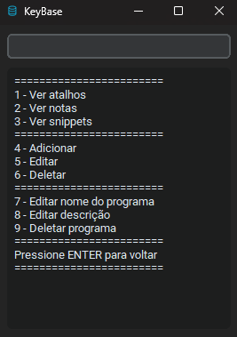

# 🔑 KeyBase

<div align="center">



Suas notas em Markdown, organizadas em pastas — na profundidade que você quiser.


</div>

## 📖 Sobre

KeyBase é uma aplicação desktop em Python para guardar referências rápidas: atalhos de teclado, comandos, trechos de código, anotações — o que você precisar consultar no dia a dia.

A organização fica por sua conta. Existem apenas dois conceitos:

- **📁 Pasta** — uma categoria. Pode conter notas e outras pastas, sem limite de profundidade.
- **📄 Nota** — um texto em Markdown.

Não há tipos fixos de conteúdo. Um "snippet" é só uma nota com um bloco de código; um "atalho" é uma nota com a combinação no título. Você decide a hierarquia:

```
~
├── Python/
│   ├── Pandas/
│   │   ├── Leitura de arquivos
│   │   └── Agrupamentos
│   └── Ambientes virtuais
├── Vscode/
│   ├── Navegação/
│   │   ├── Ctrl + P
│   │   └── Ctrl + G
│   └── Extensões
└── Rascunhos
```

## ✨ Características

- 🗂️ **Pastas aninhadas** sem limite de profundidade
- ⌨️ **Interface de teclado** — navegação por números e letras, sem mouse
- 🔍 **Busca em toda a base** por nome, descrição e conteúdo, mostrando o caminho de cada resultado
- 🎯 **Filtro instantâneo** — digite qualquer texto e Enter para filtrar o nível visível
- 🔢 **Contador duplo** `[diretas]:[total]` — quantas notas estão soltas na pasta e quantas existem em toda a hierarquia
- 💡 **Menu de comandos sob demanda** — escondido por padrão, aparece com `?` e some com `?`
- 📝 **Markdown completo** — cabeçalhos com tamanhos reais, tabelas, listas de tarefa, riscado, notas de rodapé, citações e links
- 🎨 **Syntax highlighting** em blocos de código (qualquer linguagem suportada pelo Pygments)
- ✂️ **Editar, preview ou tela dividida** ao escrever uma nota — `Ctrl+1`/`Ctrl+2`/`Ctrl+3`, ou `Ctrl+E` para alternar
- ✏️ **Editor dedicado** com realce de sintaxe — Ctrl+S salva, Esc vai para a barra (e, de novo, cancela)
- 💾 **Gravação atômica** com backup automático e snapshot diário
- 🌓 Temas claro e escuro
- 🪟 Memoriza posição e tamanho da janela

## 🚀 Como Usar

O KeyBase é operado inteiramente pelo teclado. Digite o comando no campo de cima e pressione Enter.

```
==============================================================
 ~ / Python / Pandas
==============================================================
 1 - Leitura de arquivos/                              [0]:[4]
 2 - Agrupamentos
 3 - Merge e join
==============================================================
```

### Os dois números da pasta

Cada pasta mostra `[a]:[b]`, contando **notas** (sub-pastas não entram na conta):

- **a** — notas soltas dentro da pasta;
- **b** — todas as notas da hierarquia, entrando em cada sub-pasta.

Assim `[0]:[4]` diz "nada solto aqui, mas tem 4 notas lá dentro", enquanto `[4]:[4]` diz "4 notas, e acabou". Pasta completamente vazia não mostra contador nenhum.

### O menu de comandos

O menu começa escondido, para não disputar espaço com o conteúdo.
Digite `?` (ou `Ctrl+0`, ou clique no botão `?` ao lado do campo) e ele aparece
logo abaixo do campo de comando; `?` de novo e ele some:

```
==============================================================
   P - Nova pasta        B - Buscar
   N - Nova nota         V - Voltar
   E - Editar nota       M - Ir para a raiz
   R - Renomear          C - Configuração
   D - Deletar          ?? - Ajuda completa
                      sair - Encerrar
==============================================================
 ~ / Python / Pandas
==============================================================
 1 - Leitura de arquivos/                              [0]:[4]
 2 - Agrupamentos
 3 - Merge e join
==============================================================
```

### Filtrando

Digite qualquer texto que não seja um comando e dê Enter — o nível visível é filtrado pelo nome, ignorando acento e maiúsculas. `V` limpa o filtro.

```
digitou "agr"            →   1 - Agrupamentos
                             1 de 3 itens - V limpa o filtro
```

O filtro nunca sai do lugar: o breadcrumb continua o mesmo e os números passam a indexar a lista filtrada, então `1` abre o primeiro item **do que está na tela**.

Como as letras de comando continuam valendo, use a barra para filtrar por um termo que colida com elas: `/c` filtra por "c" em vez de criar uma pasta.

### Comandos

| Comando | O que faz |
|---------|-----------|
| `1` `2` `3` … | Abre o item pelo número da lista |
| `P` | Cria uma pasta na pasta atual |
| `N` | Cria uma nota na pasta atual (e já abre o editor) |
| `E` ou `E3` | Edita o conteúdo de uma nota |
| `R` ou `R3` | Renomeia um item |
| `D` ou `D3` | Apaga um item |
| `X` ou `X3` | Move um item: você navega até a pasta de destino e confirma com `C` (`ENTER` sobe um nível, `R` vai à raiz, `ESC` cancela) |
| `Z` ou `Z3` | Duplica um item, como "Nome (cópia)" |
| `Y` ou `Y3` | Copia um item (nota ou pasta) para outra pasta: como o mover, mas o original fica |
| `Y` (na nota) | Área de transferência: `Y2` copia o 2º bloco de código; `Y` sozinho lista os blocos (e `0` copia a nota inteira) |
| `U` | Desfaz a última ação: apagar, mover, renomear, duplicar ou decifrar. Várias em sequência, enquanto nada mais tiver sido alterado depois |
| `H` (na nota) | Histórico: as versões da nota guardadas nos backups e snapshots. Abra uma e `R` restaura (e `U` desfaz a restauração) |
| `F` ou `F3` | Marca ou desmarca um favorito (`[favorito]` no fim da linha) |
| `L` | Favoritos e notas abertas recentemente, numa lista só |
| `W` ou `W3` | Exporta a pasta atual (ou a pasta 3) como arquivos `.md` numa pasta em Downloads |
| `V` | Volta um nível (ou limpa o filtro) |
| `M` | Vai direto para a raiz |
| `B` | Busca em toda a base. Tolera erro de digitação no nome ("pnadas" acha "Pandas"); nos resultados, as setas escolhem e Enter abre |
| `C` | Abre a configuração no editor (veja [Configuração](#configuração)) |
| `K` ou `K3` | Cifra ou decifra uma nota; numa pasta, cifra todas as notas dela |
| `T` | Tranca os itens cifrados; se já estiverem trancados, pede a senha e destranca |
| `S` | Troca a senha mestra |
| `texto` | Filtra a pasta atual pelo nome — é só digitar e dar Enter |
| `/texto` | O mesmo, para termos que colidem com um comando (`/b`, `/c`, `/sair`) |
| `?` | Mostra ou esconde o menu de comandos (o mesmo que `Ctrl+0`) |
| `??` | Ajuda completa |
| `sair` | Encerra |

Comandos que agem sobre um item aceitam o número junto (`D3` apaga o item 3) ou sozinho (`D` pergunta qual).

### Notas e pastas cifradas

Você escolhe o que cifrar. Tudo fica no mesmo `keybase_data.json`, protegido por uma **senha mestra** única (AES-256-GCM, com a chave derivada da senha por scrypt). Há três níveis:

| Marca na lista | O que é | O que fica visível no arquivo |
|---|---|---|
| `Senhas  [cifrada]` | Nota cifrada | O nome da nota |
| `Projetos/  [novas cifradas]:[2]:[5]` | Pasta cujas notas **novas** nascem cifradas | Nomes de tudo; o conteúdo das notas antigas |
| `Pessoal/  [cifrada]` | Pasta inteira cifrada | Só o nome da pasta |

As marcas ficam no fim da linha, emendadas na contagem `[a]:[b]`. Uma pasta cifrada trancada não mostra a contagem.

- `K3` cifra a nota 3. Na primeira vez, o KeyBase pede para você criar a senha mestra.
- `K` sobre uma nota cifrada decifra a nota, com confirmação.
- `K` sobre uma pasta oferece três opções:
  1. cifrar todas as notas dela, inclusive as das sub-pastas;
  2. ligar ou desligar "notas novas nascem cifradas";
  3. cifrar a pasta inteira, incluindo nomes, sub-pastas, notas e a descrição.
- Entrar numa pasta cifrada pede a senha se os itens cifrados estiverem trancados. Com a senha dada, nada lá dentro pede de novo, e a pasta funciona normalmente.
- Dentro de uma pasta cifrada tudo já é protegido: o `K` não cifra nada de novo e a criação de pasta não pergunta sobre notas cifradas.
- `K` sobre uma pasta cifrada decifra a pasta, com confirmação.
- Ao criar uma pasta com `P`, o KeyBase pergunta se as notas dela nascem cifradas. Enter vazio responde não.
- A senha é pedida uma vez por sessão, no primeiro item cifrado que você abrir. Os itens trancam de novo com `T` ou sozinhos depois de 10 minutos sem uso. Esse tempo é configurável com `C`, em `trancar_apos_min`.
- Com os itens trancados, a busca encontra notas cifradas só pelo nome e não enxerga nada dentro de pastas cifradas.
- Ao cifrar, os backups e snapshots ainda guardam a versão em claro. O KeyBase oferece cifrar essas cópias também, preservando o histórico.

- `S` troca a senha mestra sem recifrar nada: só a chave das notas é reenvelopada. Backups antigos continuam abrindo com a senha antiga.
- Copiar algo cifrado para a área de transferência (`Y` dentro da nota) limpa a área de transferência depois de `limpar_copia_seg` segundos (padrão 20), se ela ainda tiver o que foi copiado.
- Mover para dentro de uma pasta cifrada deixa o item sob a proteção dela; mover para fora pede confirmação, porque o item passa a ficar em claro.

> ⚠️ **Não existe recuperação de senha.** Sem a senha mestra, as notas e pastas cifradas ficam ilegíveis para sempre.

### No editor

| Tecla | Ação |
|-------|------|
| `Ctrl+S` | Salva e volta |
| `Esc` | Leva o cursor para a barra de cima; `Esc` de novo cancela (pergunta antes de descartar) |
| `Enter` na barra | Volta o cursor para o texto |
| `?` na barra | Mostra ou esconde os atalhos de edição (o mesmo que `Ctrl+0`) |
| `??` na barra | Ajuda completa, sem perder o texto não salvo |
| `Ctrl+1` | Só o editor |
| `Ctrl+2` | Só o preview (do texto **ainda não salvo**) |
| `Ctrl+3` | Tela dividida: editor à esquerda, preview à direita |
| `Ctrl+E` | Alterna entre os três |

A tela só se divide durante a edição de uma nota. Em todo o resto do app, o terminal ocupa a tela inteira.

No modo dividido, o preview acompanha o que você digita (com uma pausa curta) e a rolagem segue o editor.

**Modelos:** crie uma pasta `Modelos` na raiz e ponha nela notas comuns com a estrutura que você repete (por exemplo `# {nome}` e `Quando usar:`). Ao criar uma nota com `N`, o KeyBase oferece `1 - Em branco` e os modelos; `{nome}` e `{data}` são preenchidos. O nome da pasta é configurável (`pasta_modelos`).

Para apontar para outra nota, escreva `[[Nome da nota]]`, `[[Pasta/Nome]]` ou `[[Pasta/Nome|texto mostrado]]`: no viewer vira um link, e um link que não aponta para nenhuma nota aparece riscado. Links `http(s)://` abrem no navegador.

Para um bloco de código com destaque de sintaxe, use as cercas do Markdown:

````markdown
```python
df = pd.read_csv("dados.csv")
```
````

### Configuração

`C` abre o `keybase_config.toml` no próprio editor, como uma nota. O arquivo é criado na primeira vez que o KeyBase abre, com os valores padrão e um comentário explicando cada opção:

```toml
# Tema: "dark" (escuro) ou "light" (claro). Aplica na hora.
tema = "dark"

[fontes]
familia = "Consolas"
tamanho_saida = 14

[cofre]
# Minutos sem uso até os itens cifrados trancarem sozinhos (0 desliga).
trancar_apos_min = 10
```

- `Ctrl+S` **valida** antes de gravar. Com erro de digitação, chave desconhecida ou valor fora da faixa, nada é gravado e o erro aparece em vermelho no topo do editor.
- Tema, altura da barra de ajuda, tempo para trancar e tempo dos avisos (`tempo_aviso_ms`, quanto tempo um aviso como "Pasta criada." fica no lugar do caminho) valem na hora. Fontes valem ao reabrir o KeyBase.
- O KeyBase nunca reescreve esse arquivo sozinho: seus comentários e a formatação ficam como você deixou.
- `[dados] pasta` aponta para onde ficam os dados, por exemplo uma pasta do iCloud, Dropbox ou Google Drive, para usar os mesmos dados em vários computadores. Na primeira vez, os dados atuais são **copiados** para lá. Se outro computador tiver gravado o arquivo enquanto este estava aberto, o KeyBase não sobrescreve: guarda as suas mudanças numa cópia `keybase_data.conflito-….json` e pergunta se recarrega o do disco ou grava o daqui por cima.
- Se o arquivo estiver inválido ao abrir o app, o KeyBase usa os padrões, avisa, e não mexe no arquivo. Use `C` para corrigir.

## 🛠️ Instalação

### Usuários Windows

Baixe a última versão do executável em [Releases](https://github.com/andrei-schievelbein/keybase/releases) e execute. Não precisa instalar nada.

### Desenvolvedores

```bash
git clone https://github.com/andrei-schievelbein/keybase.git
cd keybase
pip install -r requirements.txt
python keybase.pyw
```

Testes:

```bash
QT_QPA_PLATFORM=offscreen python -m unittest discover -s tests -t .
```

Os testes rodam sem display, inclusive em CI.

## 📦 Arquivos e Portabilidade

O KeyBase é portátil: os dados ficam **ao lado do executável**, então dá para rodar de um pen drive. Se esse diretório não for gravável (por exemplo, um `.exe` instalado em `C:\Program Files`), os dados vão para `%APPDATA%\KeyBase` em vez de se perderem.

| Arquivo | Necessário? | Descrição |
|---------|-------------|-----------|
| **KeyBase.exe** | ✅ Obrigatório | O programa |
| **keybase_data.json** | ⚠️ Recomendado | Suas pastas e notas. Sem ele, você começa do zero |
| **keybase_data.bak.json** | ❌ Automático | Cópia da versão anterior, gravada antes de cada alteração |
| **keybase_data.snapshot-*.json** | ❌ Automático | Uma cópia por dia, guardando os últimos 7 dias |
| **keybase_config.toml** | ❌ Opcional | Suas preferências (tema, fontes, tempo para trancar). Editável com `C`. Recriado se faltar |
| **keybase_data.conflito-*.json** | ❌ Automático | Suas mudanças guardadas quando outro computador gravou os dados ao mesmo tempo |
| **keybase_estado.json** | ❌ Automático | Tamanho e posição da janela e último modo do editor |
| **window_config.json** | ❌ Antigo | Configuração das versões anteriores. Na primeira vez, os valores dele são copiados para o `keybase_config.toml`; depois não é mais usado |

### Se o arquivo de dados for corrompido

O KeyBase **não sobrescreve** um arquivo que não conseguiu ler. Ele abre em modo somente leitura, mostra o erro e oferece restaurar o backup ou um dos snapshots — seus dados continuam no disco enquanto isso.

## 🔧 Tecnologias

- [Python](https://www.python.org/)
- [PySide6](https://doc.qt.io/qtforpython/) — interface (Qt)
- [Markdown](https://python-markdown.github.io/) + [PyMdown Extensions](https://facelessuser.github.io/pymdown-extensions/) — renderização
- [Pygments](https://pygments.org/) — syntax highlighting
- [cryptography](https://cryptography.io/) — AES-GCM das notas cifradas
- [PyInstaller](https://www.pyinstaller.org/) — executável

## 📝 Estrutura de Dados

```json
{
    "schema_version": 4,
    "app_version": "2.0.0",
    "atualizado_em": "2026-09-13T16:22:04+00:00",
    "raiz": {
        "id": "raiz",
        "tipo": "folder",
        "nome": "KeyBase",
        "descricao": "",
        "criado_em": "2026-09-13T16:00:00+00:00",
        "atualizado_em": "2026-09-13T16:22:04+00:00",
        "filhos": [
            {
                "id": "7f3a1c2b9d4e4f0aa1b2c3d4e5f60718",
                "tipo": "folder",
                "nome": "Vscode",
                "descricao": "Editor principal",
                "criado_em": "2026-09-13T16:01:10+00:00",
                "atualizado_em": "2026-09-13T16:20:00+00:00",
                "filhos": [
                    {
                        "id": "c3d4e5f60718293a4b5c6d7e8f901234",
                        "tipo": "file",
                        "nome": "Ctrl + P",
                        "conteudo": "Abre o seletor rápido de arquivos.",
                        "criado_em": "2026-09-13T16:03:00+00:00",
                        "atualizado_em": "2026-09-13T16:22:04+00:00"
                    }
                ]
            }
        ]
    }
}
```

Um `folder` tem `filhos`; um `file` tem `conteudo`. Uma nota cifrada troca `conteudo` por `"cifrado": true` e `"conteudo_cifrado": {"nonce", "ct"}`. Nesse caso, o arquivo ganha no topo um bloco `"cofre"` com os parâmetros do scrypt e a chave das notas, cifrada pela senha. Uma pasta cujas notas nascem cifradas tem `"nasce_cifrada": true`. Uma pasta inteira cifrada troca `descricao` e `filhos` por `"cifrada": true` e `"filhos_cifrados": {"nonce", "ct"}`. A ordem de exibição é derivada (pastas antes de notas, alfabético), não armazenada — reordenar o arquivo à mão não muda nada nem quebra referências.

> **Formato anterior (v1):** versões até a 1.0.2 usavam `data.json`, com `programas` contendo listas separadas de `atalhos`, `notas` e `snippets`. Esse arquivo não é lido nem modificado pela versão atual. O script `importar_legado.py` converte esse conteúdo para o formato novo, se você quiser aproveitá-lo.

## 🤝 Contribuindo

Contribuições são bem-vindas — abra uma issue ou um pull request.

## 📄 Licença

MIT. Veja [LICENSE](LICENSE).

## 👤 Autor

Feito com ❤️ por [Andrei Schievelbein](https://www.linkedin.com/in/andrei-schievelbein/)

---
